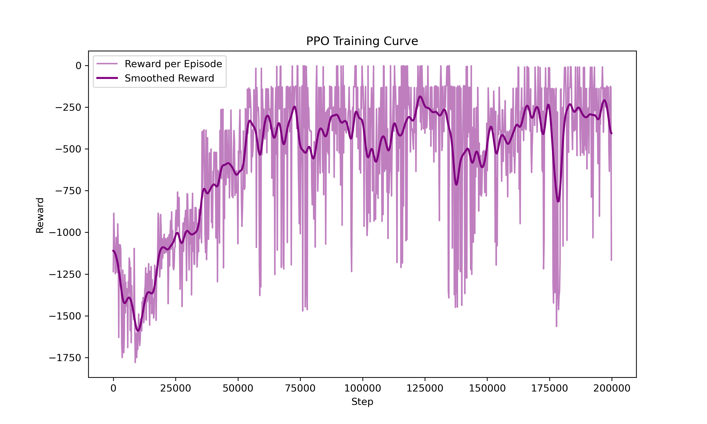

# PPO Continuous Control

This repository implements a Proximal Policy Optimization (PPO) agent for a continuous control task. The project contains a clean implementation of the PPO algorithm, a training script, a reward curve, and several GIF visualizations showing the agent's behavior at different training stages.

The trained agent can achieve an average reward of around **-250 within 100 evaluation episodes**, showing that the policy learns a significantly improved control strategy after training.

## Repository Structure

```text
PPO-continuous-control/
├── agent.py
├── training.py
├── reward_curve.png
├── gifs/
│   ├── before_training.gif
│   ├── episode_300.gif
│   ├── episode_600.gif
│   └── best_policy.gif
└── README.md
```

- `agent.py`: defines the PPO agent, including the actor network, critic network, action sampling, advantage calculation, and policy update.
- `training.py`: runs the training loop, collects trajectories, updates the PPO agent, evaluates performance, and saves training results.
- `reward_curve.png`: shows the reward progression during training.
- `gifs/`: visualize the agent's behavior at different stages of training.

## Method

This project uses **Proximal Policy Optimization**, a policy-gradient reinforcement learning algorithm designed to improve training stability by limiting how much the policy changes during each update.

The main components are:

- **Actor network**: outputs actions for continuous control.
- **Critic network**: estimates the value of each state.
- **Clipped surrogate objective**: prevents overly large policy updates.
- **Advantage estimation**: measures whether an action performs better or worse than expected.
- **Entropy regularization**: encourages exploration during training.

For continuous action spaces, the actor samples actions from a probability distribution and then maps them into the valid action range.

## Training Result

After training, the agent is able to produce much smoother and more effective control behavior compared with the initial random policy.

The average reward can reach approximately:

```text
Average reward over 100 evaluation episodes: about -250
```

This indicates that the trained policy has learned a meaningful control strategy for the environment.

## Reward Curve

The following figure shows the reward curve during training:



The reward generally improves as training progresses, although some fluctuations are expected because PPO is an on-policy reinforcement learning algorithm and the policy continues to explore during training.

## Behavior Visualization

The following GIFs show the agent's behavior at different training stages.

### Early Training

At the beginning of training, the agent behaves almost randomly and has not yet learned an effective strategy.


### Intermediate Training

After some training episodes, the agent begins to learn useful control patterns, but the behavior may still be unstable.


### Later Training

The policy becomes more consistent and the agent can achieve better control performance.


### Trained Agent

After sufficient training, the agent shows a much more stable and effective behavior.


## How to Run

Install the required dependencies first:

```bash
pip install torch numpy matplotlib gymnasium
```

Then run the training script:

```bash
python training.py
```

Depending on your environment setup, you may also need extra packages for rendering, such as:

```bash
pip install imageio
```

## Notes

The training result may vary slightly between different runs because reinforcement learning is sensitive to random seeds, initialization, exploration noise, and hardware settings.

For more reproducible results, it is recommended to set random seeds in Python, NumPy, PyTorch, and the environment.

## Possible Improvements

Some possible future improvements include:

- tuning learning rates and PPO clipping parameters;
- adding learning-rate scheduling;
- comparing CPU and GPU training speed;
- saving and loading trained models;
- adding command-line arguments for different training settings;
- testing the PPO implementation on more continuous control environments.

## License

This project is intended for learning and demonstration purposes.
